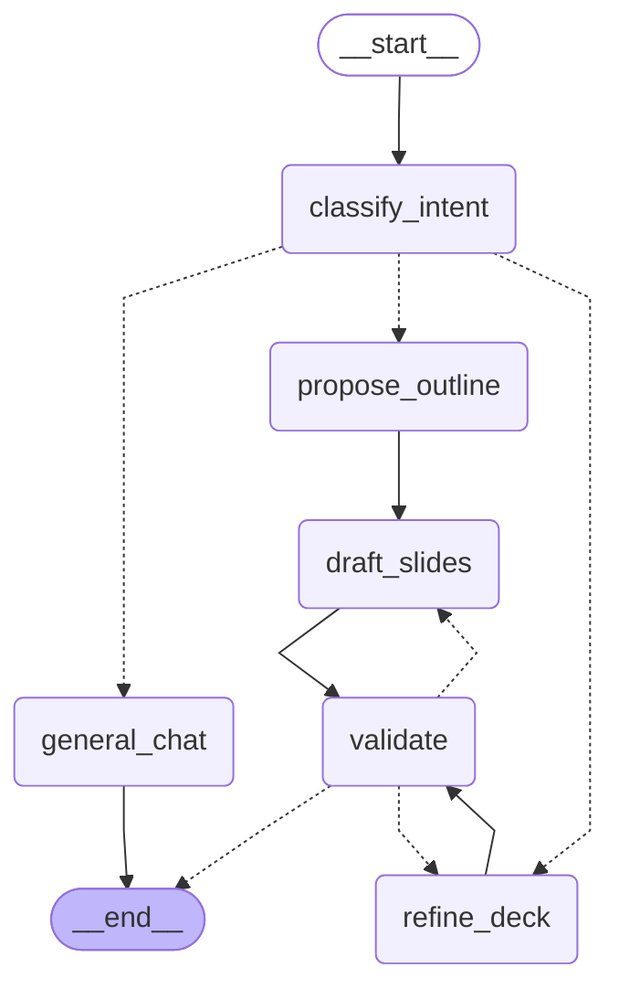

# Slideia AI Agent Graph Structure

This file is automatically generated by running the `graph.py` module.

Below is the Mermaid representation of the compiled LangGraph orchestration structure:

```mermaid
---
config:
  flowchart:
    curve: linear
---
graph TD;
	__start__([<p>__start__</p>]):::first
	classify_intent(classify_intent)
	propose_outline(propose_outline)
	draft_slides(draft_slides)
	refine_deck(refine_deck)
	validate(validate)
	general_chat(general_chat)
	__end__([<p>__end__</p>]):::last
	__start__ --> classify_intent;
	classify_intent -.-> general_chat;
	classify_intent -.-> propose_outline;
	classify_intent -.-> refine_deck;
	draft_slides --> validate;
	propose_outline --> draft_slides;
	refine_deck --> validate;
	validate -.-> __end__;
	validate -.-> draft_slides;
	validate -.-> refine_deck;
	general_chat --> __end__;
	classDef default fill:#f2f0ff,line-height:1.2
	classDef first fill-opacity:0
	classDef last fill:#bfb6fc

```
